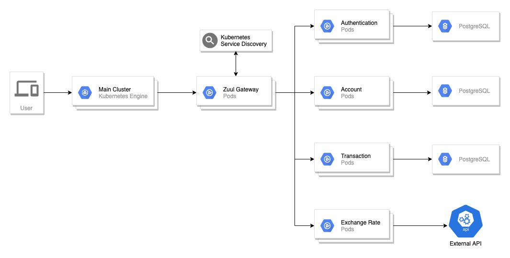

# E-Wallet
บริการ E-Wallet ที่ช่วยในการแลกเปลี่ยนสกุลเงินต่างๆ ได้สะดวกยิ่งขึ้น โดยไม่จำเป็นต้องแลกไว้ล่วงหน้า โดยให้บริการ

- E-Wallet ที่สามารถเก็บได้หลายสกุลเงิน โดยสามารถเปิด, ปิด Wallet ได้ด้วยตนเอง
- อัตราแลกเปลี่ยนสกุลเงิน อ้างอิงจาก [https://exchangeratesapi.io/](https://exchangeratesapi.io/) ทุกชั่วโมง
- สามารถโอนเงินระหว่าง Wallet

# Architecture

1. Transactional Service - Deposit, Withdrawal, Exchange and Transfer
2. Account Service - Create, Get, Update and Delete Wallet
3. Authentication Service - Authenticate user
4. Currency Exchange Service - Provice currency exchange rate from external API

# Service Features

## Transactional Service
- Deposit money to wallet
- Withdraw money to external provider
- Transfer money to another wallet
- Exchange money with in wallet
- Payment

## Account Service
- Get current wallet balance
- Update wallet balance
- Delete wallet on account deactivate

## Authentication Service
- Provide simple authentication using JWT
- Generate token for another service

## Currency Exchange Service
- Provice exchange rate with hourly update

# API Endpoints

## Transactional Service
- `/services/transaction/deposit`
- `/services/transaction/withdraw`
- `/services/transaction/exahange`
- `/services/transaction/transfer`

## Account Service
- `/services/account`

## Authentication Service
- `/services/auth/register`
- `/services/auth/login`
- `/services/auth/logout`
- `/services/auth/me`

## Currency Exchange Service
- `/services/exchange`
- `/services/exchange?base=<u>THB</u>`

Remark : sample request and response coming soon

# Team Member

|ไทธนา อยู่มี|พขร ศรียอดเวียง|วิพุธ ภู่ทอง|อภิชาติ ชัยณรงค์ฤทธิ์|
| :-: | :-: | :-: | :-: |
|60070029|60070057|60070090|60070111|
|    [@ttaitana](https://github.com/ttaitana)    |     [@boomNDS](https://github.com/boomNDS)     |     [@wiput1999](https://github.com/wiput1999)     | [@apichart2425](https://github.com/apichart2425) |
